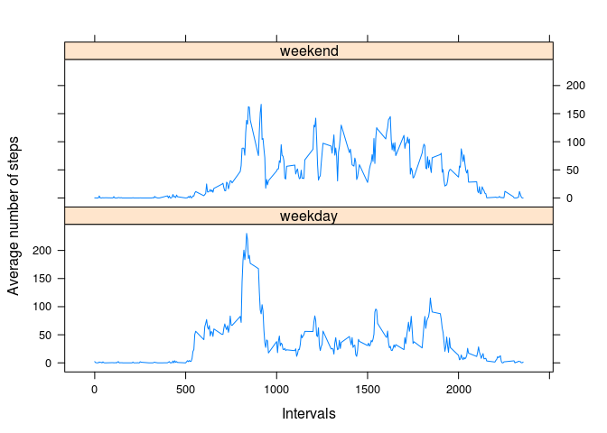

# Reproducible Research: Peer Assessment 1


## Loading and preprocessing the data

```r
url <- "activity.zip"
data <- read.csv(unz(url, "activity.csv"))
data$date <- as.Date(data$date, format = "%Y-%m-%d")
```


## What is mean total number of steps taken per day?
Plot the histogram of the total number of steps taken each day


```r
steps_per_day <- tapply(data$steps, data$date, sum, na.rm = TRUE)
hist(steps_per_day, xlab = "Total steps per day",
     main = "Histogram of total steps per day")
```

 

Calculate the mean and median total number of steps taken per day

```r
mean(steps_per_day)
```

```
## [1] 9354.23
```

```r
median(steps_per_day)
```

```
## [1] 10395
```


## What is the average daily activity pattern?
Plot of the 5-minute interval (x-axis) and the average number of steps taken, averaged across all days (y-axis)


```r
meanSteps_per_interval <- tapply(data$steps, data$interval, mean, na.rm = TRUE)
plot(data$interval[1:288], meanSteps_per_interval, type = "l",
     xlab = "5-minute interval", ylab = "Average of steps",
     main = "Average of steps per 5-minute intervals")
```

 

Find the 5-minute interval, on average across all the days in the dataset, that contains the maximum number of steps

```r
as.integer(names(which.max(meanSteps_per_interval)))
```

```
## [1] 835
```

## Imputing missing values
Calculate the total number of missing values in the dataset


```r
sum(is.na(data$steps))
```

```
## [1] 2304
```

Create a new dataset that is equal to the original dataset but with the missing data filled in using the mean for corresponding 5-minute interval

```r
na_interval <- data$interval[is.na(data$steps)]
na_interval <- as.character(na_interval)
new_data <- data
new_data$steps[is.na(new_data$steps)] <- meanSteps_per_interval[na_interval]
```

Plot the histogram of the total number of steps taken each day

```r
nsteps_per_day <- tapply(new_data$steps, new_data$date, sum)
hist(nsteps_per_day, xlab = "Total steps per day",
     main = "Histogram of total steps per day (NAs filled in)")
```

 

Calculate the mean and median total number of steps taken per day

```r
mean(nsteps_per_day)
```

```
## [1] 10766.19
```

```r
median(nsteps_per_day)
```

```
## [1] 10766.19
```

As you can see both mean and median have increased in comparison to the mean and median of dataset with missing values. And also the histogram has became much more symmetric around its mean.


## Are there differences in activity patterns between weekdays and weekends?

Create a new factor variable in the dataset with two levels – “weekday” and “weekend” indicating whether a given date is a weekday or weekend day.

```r
days <- weekdays(new_data$date)
days[days %in% c("Saturday","Sunday")] <- "weekend"
days[!(days %in% c("weekend"))] <- "weekday"
new_data$daytype <- as.factor(days)
```

plot of the 5-minute interval (x-axis) and the average number of steps taken, averaged across all weekday days or weekend days (y-axis)

```r
library(lattice)
weekend_data <- new_data[new_data$daytype == "weekend",]
weekday_data <- new_data[new_data$daytype == "weekday",]

mean_step_weekend <- tapply(weekend_data$steps, weekend_data$interval, mean)
mean_step_weekday <- tapply(weekday_data$steps, weekday_data$interval, mean)

mean_data <- data.frame(stepmean = c(mean_step_weekday, mean_step_weekend),
                        interval = c(new_data$interval[1:288], new_data$interval[1:288]),
                        daytype = c(rep("weekday", 288), rep("weekend", 288)))
xyplot(mean_data$stepmean ~ mean_data$interval | mean_data$daytype, 
       type = "l", layout = c(1,2), xlab = "Intervals", 
       ylab = "Average number of steps")
```

 
